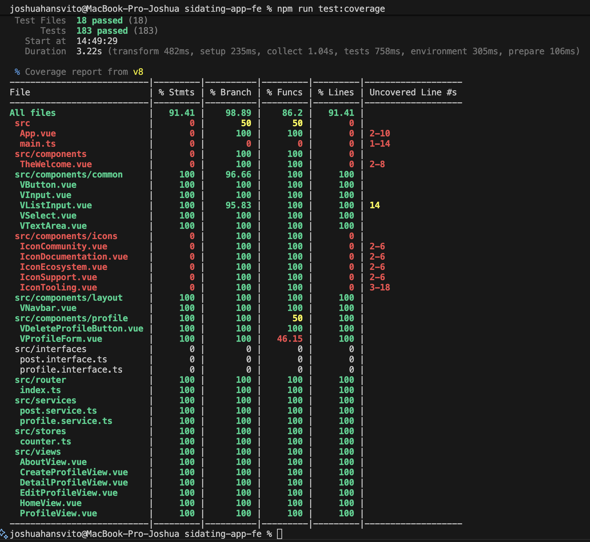

# sidating-app-fe

# Tutorial 6
## 1. Perhatikan apa yang terjadi pada file index.vue pada branch feat/tutorial-6. Apa yang terjadi setelah git cherry-pick dilakukan? Apakah kita bisa melakukan cherry-pick tanpa harus melakukan commit?
Setelah git cherry-pick dijalankan di branch feat/tutorial-6, file tutorial-6/index langsung berubah, dan git cherry-pick langsung membuat commit baru dengan perubahan yang sama di branch aktif (branch feat/tutorial-6). Ya, cherry-pick bisa dilakukan tanpa harus membuat commit baru secara otomatis. Menggunakan perintah git cherry-pick -n <sha>, file terbaru akan masuk kedalam staging area dulu, dan tidak membuat commit secara langsung. 

referensi: https://git-scm.com/docs/git-cherry-pick

## 2. Apa yang penyebab dari konflik tersebut?
Konflik muncul saat `git merge tutorial6-for-merge` ke `feat/tutorial-6` karena kedua branch melakukan perubahan pada bagian/baris yang sama di `tutorial-6/index.vue`. Karena commit “add conflict text at feat/tutorial-6” dan “tutorial6: add text at tutorial6-for-merge” memiliki perubahan dibagian yang sama (overlapping changes), sehingga Git tidak bisa menggabungkan otomatis dan menandai file dengan penanda konflik (`<<<<<<<`, `=======`, `>>>>>>>`).  

Referensi: https://git-scm.com/docs/git-merge

## 3. Jelaskan perbedaan dari "rebase --continue", "rebase --skip", dan "rebase --abort"!
- rebase --continue: Dilanjutkan setelah konflik pada commit saat ini diselesaikan dan perubahan sudah di-stage (git add). Git menerapkan commit berikutnya dalam rangkaian rebase.
- rebase --skip: Melewati commit yang sedang bermasalah (tidak diterapkan ke hasil rebase) dan lanjut ke commit berikutnya.
- rebase --abort: Membatalkan proses rebase dan mengembalikan working tree serta HEAD ke keadaan sebelum rebase dimulai.

referensi: https://git-scm.com/docs/git-rebase

## 4. Apa perbedaan Git Merge dengan Git Rebase? Buatlah/carilah ilustrasi yang dapat menggambarkan perbedaanya! Anda bisa menggunakan commit history (git log-oneline) Anda setelah melakukan rebase.
- Merge: Menggabungkan dua riwayat dan membuat “merge commit” baru (dua parent). Riwayat tetap bercabang, tidak mengubah kode SHA commit lama. 
- Rebase: Memindahkan/menulis ulang commit di atas base baru sehingga riwayat jadi linear. Mengubah SHA commit yang di‑rebase. 

Ilustrasi riwayat:
Rebase:
```
* e2f3c1e (HEAD -> feat/tutorial-6) tutorial6: add text at tutorial6-for-merge
* 64a974e add conflict text at feat/tutorial-6
* c9d8e7f (origin/main, main) chore: update docs
* b8a7c6d feat(tutorial-4): Menyelesaikan latihan fitur post
* a1b2c3d init: initialize project
```
Merge:
```
*   f0e1d2c (HEAD -> feat/tutorial-6) Merge branch 'tutorial6-for-merge' into feat/tutorial-6
|\  
| * 46f08c4 (tutorial6-for-merge) tutorial6: add text at tutorial6-for-merge
* | 64a974e add conflict text at feat/tutorial-6
|/  
* c9d8e7f (origin/main, main) chore: update docs
* b8a7c6d feat(tutorial-4): Menyelesaikan latihan fitur post
* a1b2c3d init: initialize project
```
referensi: https://www.atlassian.com/git/tutorials/merging-vs-rebasing

## 5. Mengapa hal pada langkah no 4 bisa terjadi? Mengapa git stash menjadi solusinya? Bagaimana jika kita tidak melakukan Git Stash Pop?
- Saat checkout ke branch lain, ada perubahan lokal yang ada pada `tutorial-6/git-stash/stash.vue` yang akan tertimpa oleh isi branch tujuan. Jadi, git memblokir checkout untuk mencegah hilangnya perubahan yang belum ter-commit.
- Git stash menjadi solusinya karena `git stash` menyimpan snapshot perubahan di working directory dan index ke stack “stash”, lalu membersihkan working tree sehingga checkout/merge/rebase bisa dilakukan tanpa konflik. Setelah pindah branch, perubahan bisa dikembalikan.
- Jika tidak melakukan git stash pop, maka perubahan tetap aman di stack stash dan tidak muncul di working tree/cabang mana pun. Jadi, perubahan itu tidak ikut ter-commit.

referensi: https://git-scm.com/docs/git-stash


